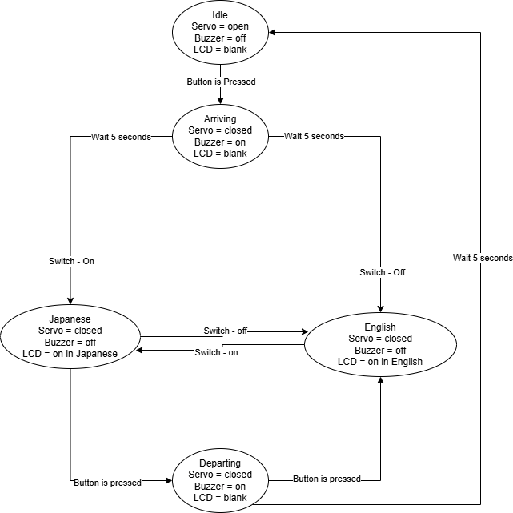

# Final project proposal

- [x] I have reviewed the project guidelines.
- [x] I will be working alone on this project.
- [x] No significant portion of this project will be (or has been) used in other course work.

## Embedded System Description

At a high level, explain in 2-3 sentences what your embedded system will do.  Then, in 1-2 sentences each, explain each input, the process, and each output. This section is the bulk of the proposal.

This system will simulate a stop at a major train station in Japan. The system will be able to simulate the arrival of a train by pressing a button. Upon arrival of a train, the gate (a servo motor) will close so people can't walk onto the track, and the PA system (an active buzzer) will sound for a few seconds. At this point, the monitor (LCD) will display the name of the train line, direction of travel, and departure time (all of these will be randomly decided). The system will default to Japanese, but the user can request for the language to be changed to English (by pressing a second button) or to be changed back to Japanese (press the second button again). Once the train wants to leave (the second button is pressed again), the gate (servo) will open, the PA system (buzzer) will sound, and the train will depart and the monitor (LCD) will clear. The process can start once again.

## Hardware Setup

What hardware will you require? Provide a conceptual circuit diagram and/or block diagram to help the reviewers understand your proposal. Be sure to introduce and discuss your figures in the text.

I will require both an active buzzer, two buttons, and a servo motor. Both of these I can probably get at Radioshack or Amazon for like 2 bucks. I will also reuse the i2c LCD module from the later labs.

## Software overview

Discuss, at a high level, a concept of how your code will work. Include a *high-level* flowchart. This is a high-level concept that should concisely communicate the project's concept.

The code will be structured like a state machine. The initial state will be the idle state, where no outputs are being driven, and it simply waits for the arrival of a train to go to the next state. The next state will be the arriving state. In this state, the gate will close, the PA system will sound, and the system will wait a few seconds for the train to arrive and come to a stop. The next state will be the English state. In this state, the LCD will have train information displayed, and it will be waiting for either the departure button or the language toggle button to be pressed. If the latter is pressed, the system will move on to the Japanese state, where everything is the same except the LCD is displaying Japanese information now. The same button can be pressed to switch back to the English state. If the system is in English or Japanese state and the departure button is pressed, the system will move to the departing state, where the gate will open, the buzzer sounds, and the LCD display clears. After a few seconds, the system will return to idle state. A flowchart for this is presented below.

## Testing Procedure

Briefly describe how you will test and verify that your project is a success. Think about how you will *demo* the final project. If you need extra equipment for the demo, be sure that you can either bring the equipment or convincingly simulate it. For example, if you want to build a system that uses CAN bus to interface with your car, you won't be able to bring your car into Cobleigh for the demo...
I will test each component of the project individually and record proof that those parts are able to function in a vacuum in the case that I fail to be able to demo the full project properly. For the demo, I see nothing that would cause me to not demo the full project in-class by the due date.

## Prescaler

Desired Prescaler level: 

- [ ] 100%
- [ ] 95% 
- [x] 90% 
- [ ] 85% 
- [ ] 80% 
- [ ] 75% 

### Prescalar requirements 

**Outline how you meet the requirements for your desired prescalar level**

**The inputs to the system will be:**
1.  Button to simulate train arriving and leaving
2.  Button to toggle screen language between English and Japanese

**The outputs of the system will be:**
1.  Servo to simulate gate
2.  LCD to show basic train information
3.  Buzzer to simulate PA announcement

**The project objective is**

To make a system for arriving and departing trains in a Japanese train station

{text – 1 to 2 sentences}

**The new hardware or software modules are:**
1. Active buzzer that simply buzzes when powered and is silent when unpowered
2. Servo that takes in a PWM signal, posing in different positions depending on PWM signal.

The Master will be responsible for:

{text – 1 to 2 sentences}
Program logic, inputs, and the servo and buzzer.

The Slave(s) will be responsible for:
The single slave will be responsible for what the LCD is displaying.

### Argument for Desired Prescaler

Consider the guidelines presented in the lecture notes and convince the reviewers that this proposal meets the minimum requirements for your desired prescale level.

My system has 2 inputs and 3 outputs, which covers the necessary inputs and outputs. Both inputs are just buttons, but they serve 2 very different functions, so they are distinct enough to be their own inputs.

The master controller will tell the LCD what to do, and the slave controller is responsible for making the LCD display the desired outputs.

This serves a "real" objective of providing a simple system for Japanese train stations.

This introduces two buttons, a buzzer, and a servo motor to the project. The servo is the most complex of these, and involves driving a PWM signal to it in order to get the desired position, and was not used before in this class or 371, nor is it too similar to previously used hardware.

Therefore, this project meets the requirements for the 90% prescalar.
